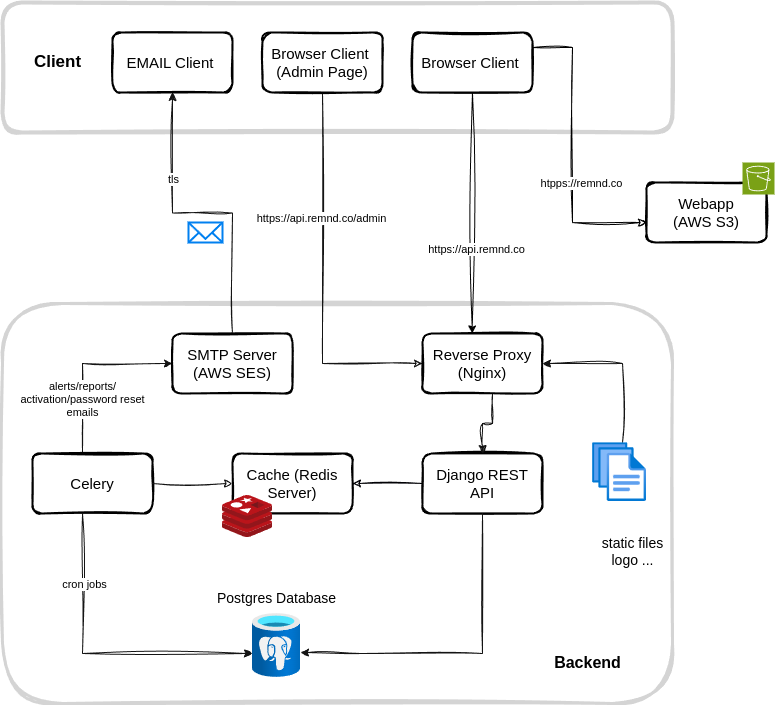

<p align="center">
  
</p>

An app to remind users about their online purchase and auto-renewing
subscriptions.

[](https://github.com/grizzi/remind/actions/workflows/ci.yml)

# How it works

<p align="center">
  
</p>

# Local Development

## Run locally

- Install [`docker compose`](https://docs.docker.com/compose/install/standalone/)
- In the root of directory of this repository run:

  ```bash
  docker compose up
  ```

- Open the webapp in your browser at
  [http://localhost:5173/login](http://localhost:5173/login)

- Open the mail catcher in your browser at
  [http://localhost:8025](http://localhost:8025)

## Run tests

```bash
docker compose run --rm backend python manage.py test
docker compose run --rm backend python manage.py test --pattern="tests_*.py" # to run specific tests

```

## Create admin and log to admin panel

- Create a superuser in the `django` container:

  ```bash
  docker compose run backend python manage.py createsuperuser
  ```

- Log in to the admin panel at
  [http://localhost:8000/admin](http://localhost:8000/admin)

## Contributing

We use pre-commit hooks to ensure code quality. Install all the required
dependencies for the hook to run.

### Pre-commit Hooks

- `pre-commit` is a framework for managing and maintaining multi-language
  pre-commit hooks.

- `checkov` is run as a precommit hook to check for security issues in the
  infrastructure. Integration instructions are available at the
  [official page](https://www.checkov.io/2.Basics/Installing%20Checkov.html)

```bash
pipx install pre-commit
pipx install checkov

# required once
curl -fsSL https://raw.githubusercontent.com/infracost/infracost/master/scripts/install.sh | sh
infracost auth login # required once or to reauthenticate
infracost configure set currency CHF
```

# Deployment workflow

1. Install aws cli
2. Make sure you have the following in your `~/.aws/config` file:

```
[profile app-admin]
region = eu-central-1
```

3. Export the aws credentials set in the `~/.aws/credentials` file:

```bash

[app-admin]
aws_access_key_id = xxx
aws_secret_access_key = xxx
```

```bash
export AWS_PROFILE=app-admin
```

4. Build and upload the webapp to AWS S3

```bash
cd frontend
npm install
npm run build
aws s3 cp dist/ s3://remind-webapp-static/ --recursive
```

5. Run the backend in the EC2 instance. This assumes that the required infrastructure has already been provisioned. See the [infrastructure documentation](./infra/infra.md) for more info.

```bash
docker compose -f compose.deploy.yaml up
```
